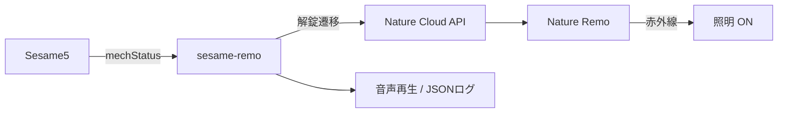

# sesame-remo

Sesame5をBLEで監視し、解錠するとNature Remoで部屋の照明をONにすると同時に、macOSの音声を再生する常駐CLIです。操作元は判定せず、Sesame5から届く`mechStatus`の解錠状態を使います。



## 必要なもの

- Sesame5とBluetooth通信できるmacOSマシン
- [uv](https://docs.astral.sh/uv/getting-started/installation/)
- Nature Remoアプリで登録済みの照明
- Nature Cloud API Personal Access Token

Sesame5のBLE通信仕様を確認するときは、Candy Houseの公式SDKを参照します。

- [SesameSDK Android with DemoApp](https://github.com/CANDY-HOUSE/SesameSDK_Android_with_DemoApp)
- [SesameSDK iOS with DemoApp](https://github.com/CANDY-HOUSE/SesameSDK_iOS_with_DemoApp)
- [SesameSDK ESP32 with DemoApp](https://github.com/CANDY-HOUSE/SesameSDK_ESP32_with_DemoApp)

## セットアップ

```bash
git clone https://github.com/hiroto7/sesame-remo.git
cd sesame-remo
uv sync
cp config.example.toml config.toml
```

SesameアプリでSesame5のownerまたはmanager共有リンクを発行し、Macのクリップボードへコピーします。共有リンクには鍵が含まれるため、チャットやIssueへ貼らないでください。guest鍵はCandy Houseサーバーによる署名が必要なため、このBLE単独版では使用できません。

```bash
pbpaste | uv run sesame-remo decode-qr
```

表示されたUUIDとsecret keyを、Nature Remo設定とともに`config.toml`へ記入します。`config.toml`はGit管理対象外です。

```toml
sesame_id = "..."
sesame_secret_key = "..."
nature_token = "..."
nature_light_appliance_id = "..."
nature_light_button = "on"
```

[Natureのアクセストークン管理画面](https://home.nature.global/)でPersonal Access Tokenを発行します。登録済みLIGHT家電のappliance IDはNature Cloud APIの`GET /1/appliances`で確認できます。

設定後、現在の施錠状態だけを確認する場合:

```bash
uv run sesame-remo status-dump --config config.toml
```

## Foreground実行

```bash
uv run sesame-remo monitor --config config.toml
```

施錠中から解錠中へ変化すると照明がONになり、音声が再生されます。施錠、BLE切断、終了時には音声を停止します。標準出力には状態・接続・Nature APIの結果をJSON Linesで出力します。

音声設定は`--sound`、`--volume`、`--repeat-gap`、監視設定は`--scan-timeout`、`--poll-interval`で変更できます。

## macOSへ常駐登録する

foregroundで動作確認後、同梱plistの絶対パスを置き換えてLaunchAgentとして登録します。

```bash
PROJECT_DIR="$PWD"
PLIST="$HOME/Library/LaunchAgents/com.example.sesame-remo.plist"
mkdir -p "$HOME/Library/LaunchAgents"
sed \
  -e "s|/absolute/path/to/.venv/bin/python|$PROJECT_DIR/.venv/bin/python|" \
  -e "s|/absolute/path/to/config.toml|$PROJECT_DIR/config.toml|" \
  -e "s|/absolute/path/to/project|$PROJECT_DIR|" \
  launchd/com.example.sesame-remo.plist > "$PLIST"
plutil -lint "$PLIST"
launchctl bootstrap "gui/$(id -u)" "$PLIST"
launchctl kickstart -k "gui/$(id -u)/com.example.sesame-remo"
```

状態確認とログ確認:

```bash
launchctl print "gui/$(id -u)/com.example.sesame-remo"
tail -f /tmp/sesame-remo.out.log
tail -f /tmp/sesame-remo.err.log
```

停止・登録解除:

```bash
launchctl bootout "gui/$(id -u)" \
  "$HOME/Library/LaunchAgents/com.example.sesame-remo.plist"
```

## トラブルシュート

### 起動時に設定エラーになる

`sesame_id`、`sesame_secret_key`、`nature_token`、`nature_light_appliance_id`を確認してください。Nature Remoの照明がLIGHT家電として登録されていることも確認します。

### 状態や照明が更新されない

MacとSesame5の距離、macOSのBluetooth権限、JSONLログの`advertisement_received`、`connection_attempt`、`connected`を確認してください。

### 音声が再生されない

`--sound`で指定したファイルの存在と、macOSの音声出力を確認してください。

## 開発時の確認

```bash
uv run ruff check .
uv run ruff format --check .
uv run basedpyright --warnings
uv run pytest
```
