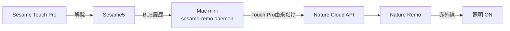

# sesame-remo

Sesame Touch ProでSesame5を解錠したときだけ、Nature Remo経由で照明をONにするmacOS向けCLI daemonです。Wi-Fiモジュールは不要です。

ICカード・指紋・暗証番号の区別はせず、Touch Pro経由の解錠をすべて対象にします。Sesameアプリや手動サムターンによる解錠は無視します。照明OFFは行いません。



## 必要なもの

- Sesame5とSesame Touch Pro
- Nature Remoアプリで登録済みの照明
- Sesame5とBluetooth通信できる位置にあるmacOSマシン
- インターネット接続（Nature Cloud API用）
- [uv](https://docs.astral.sh/uv/getting-started/installation/)

Python 3.13は`.python-version`に従ってuvが管理します。システムPythonを別途用意する必要はありません。

## セットアップの流れ

初回だけ、次の順番で設定します。

1. リポジトリをcloneして依存関係を入れる
2. Sesame5のUUIDとsecret keyを取得する
3. Nature tokenと照明のappliance IDを取得する
4. 実機履歴からTouch Pro固有のsource tagを調べる
5. foregroundで動作確認する
6. LaunchAgentとして常駐させる

秘密情報はすべて`config.toml`に保存します。このファイルは`.gitignore`に含まれており、Gitには入りません。

## 重要な設計上の制約

### なぜSesame5の履歴を読むのか

Sesame5のBLE advertisementや接続直後の状態通知だけでは、解錠状態になったことは検出できても、Touch Pro・Sesameアプリ・手動サムターンのどれによる解錠かを判別できません。

このdaemonは、Sesame5の履歴payloadに含まれる次の差分を使ってTouch Pro経由か判定します。

- Touch ProとSesameアプリによるBLE解錠は`event_type=2`だが、末尾16 byteのsource tagが異なる
- 手動サムターン解錠は`event_type=8`

「解錠方法を問わず照明をONにする」だけなら、履歴を使わず状態変化を監視する設計も可能です。「Touch Pro経由だけ」という現在の要件では、Sesame5を監視する限り履歴が必要です。

### なぜ読んだ履歴を削除するのか

Sesame5は履歴キューの先頭1件を返し、そのレコードを削除するまで次の履歴へ進みません。そのため、daemonは処理に成功した履歴をSesame5から削除します。削除しない設定へ単純に変えると、同じ履歴を読み続けて新しいTouch Pro解錠へ到達できません。

この削除には次の副作用があります。

- daemonが先に削除した履歴は、公式Sesameアプリが後から取得できない可能性がある
- 公式アプリが先に取得・削除した履歴は、daemonが検出できず照明が点かない可能性がある
- 公式アプリとdaemonが同時にBLE接続すると、一時的な接続失敗や遅延が起こり得る

つまり、現在の実装は公式アプリの履歴と共存する非破壊な監視ではありません。公式履歴を保持したままTouch Proだけを確実に検出するには、将来的にTouch Pro本体のBLEイベントを直接監視する別方式の調査が必要です。

また、Open Sensorなどの履歴も同じキューへ入るため、履歴が多い環境やBLE受信強度が弱い環境では、Touch Pro解錠の処理まで遅延することがあります。

## 1. インストール

```bash
git clone https://github.com/hiroto7/sesame-remo.git
cd sesame-remo
uv sync
cp config.example.toml config.toml
```

macOSでuvが未導入なら、Homebrewでもインストールできます。

```bash
brew install uv
```

## 2. Sesame5の鍵を設定する

SesameアプリでSesame5のownerまたはmanager共有リンクを発行し、Macのクリップボードへコピーします。guest鍵はCandy Houseサーバーによる署名が必要なため、このBLE単独版では使えません。

共有リンクには鍵が含まれます。チャットやIssueへ貼らないでください。

```bash
pbpaste | uv run sesame-remo decode-qr
```

表示された2行を`config.toml`の同名項目へコピーします。

```toml
sesame_id = "..."
sesame_secret_key = "..."
```

## 3. Nature Remoを設定する

[Natureのアクセストークン管理画面](https://home.nature.global/)でPersonal Access Tokenを発行し、`config.toml`へ設定します。

```toml
nature_token = "..."
```

tokenをクリップボードへコピーした状態で次を実行すると、登録済みLIGHT家電の名前とappliance IDを確認できます。token自体は表示しません。

```bash
export NATURE_TOKEN="$(pbpaste)"
curl -sS -H "Authorization: Bearer $NATURE_TOKEN" \
  https://api.nature.global/1/appliances \
  | uv run python -c 'import json, sys; [print(a["nickname"], a["id"]) for a in json.load(sys.stdin) if a.get("type") == "LIGHT"]'
unset NATURE_TOKEN
```

対象照明のIDとONボタンを設定します。通常のONは`on`、全灯を使いたい場合は機種に応じて`on-100`などを指定します。

```toml
nature_light_appliance_id = "..."
nature_light_button = "on"
```

## 4. Touch Proの判定値を採取する

Sesame5のBLE解錠履歴では、末尾16 byteが操作元ごとに安定したsource tagとして観測できます。Touch Pro解錠を2回、Sesameアプリ解錠を1回採取し、Touch Proの2件だけで一致する値を設定します。手動解錠は別の履歴種別です。

採取中はスマホのSesameアプリを完全終了するか、スマホのBluetoothをOFFにしてください。アプリが先に履歴を取得・削除するとMacから読めません。

履歴を1件読むたびに次を実行します。

```bash
uv run sesame-remo history-dump --config config.toml --delete-after-read
```

施錠してから解錠した場合、施錠と解錠で2件の履歴ができるため、コマンドも2回必要です。JSONの`is_unlock`が`true`の行を比較してください。

- Touch Proまたはアプリによる解錠: `event_type`は`2`
- 手動サムターン解錠: `event_type`は`8`
- source tag: `payload_hex`の最後の32文字（16 byte）

Touch Pro解錠2件で同じ末尾32文字になり、アプリ解錠では異なることを確認したら設定します。

```toml
[touch_pro_match]
contains_hex = ["Touch Pro履歴の末尾32文字"]
```

最後に、daemonが履歴キューを進められるよう次を変更します。

```toml
delete_history_after_read = true
```

注意: `--delete-after-read`またはdaemonが削除した履歴は、Sesameアプリから後で取得できなくなります。raw payloadはコマンド出力またはdaemonログに残ります。

## 5. Foregroundで動作確認する

```bash
uv run sesame-remo daemon --config config.toml
```

照明をOFFにしてから、Sesame5を施錠し、Touch Proで解錠します。照明がONになり、次のログが出れば成功です。

```text
turned on Nature Remo light for record ...
```

Sesameアプリ解錠と手動解錠では照明がONにならないことも確認します。終了は`Ctrl-C`です。

macOSでBluetooth利用許可が表示されたら、実行に使うターミナルを許可してください。

## 6. macOSへ常駐登録する

foregroundで成功した後に行います。リポジトリ直下で次を実行すると、同梱のplistへ現在の絶対パスを埋め込みます。

```bash
PROJECT_DIR="$PWD"
PLIST="$HOME/Library/LaunchAgents/com.example.sesame-remo.plist"
mkdir -p "$HOME/Library/LaunchAgents"
sed \
  -e "s|/absolute/path/to/.venv/bin/python|$PROJECT_DIR/.venv/bin/python|" \
  -e "s|/absolute/path/to/config.toml|$PROJECT_DIR/config.toml|" \
  -e "s|/absolute/path/to/project|$PROJECT_DIR|" \
  launchd/com.example.sesame-remo.plist > "$PLIST"
plutil -lint "$PLIST"
launchctl bootstrap "gui/$(id -u)" "$PLIST"
launchctl kickstart -k "gui/$(id -u)/com.example.sesame-remo"
```

状態確認:

```bash
launchctl print "gui/$(id -u)/com.example.sesame-remo"
```

ログ確認:

```bash
tail -f /tmp/sesame-remo.out.log
tail -f /tmp/sesame-remo.err.log
```

停止・登録解除:

```bash
launchctl bootout "gui/$(id -u)" \
  "$HOME/Library/LaunchAgents/com.example.sesame-remo.plist"
```

plistを変更した場合は、一度`bootout`してから再度`bootstrap`してください。

## 設定項目

| 項目 | 内容 |
|---|---|
| `sesame_id` | Sesame5のUUID |
| `sesame_secret_key` | Sesame5の16-byte secret key |
| `nature_token` | Nature Cloud APIのPersonal Access Token |
| `nature_light_appliance_id` | Nature Remoで登録したLIGHT家電のID |
| `nature_light_button` | 送るLIGHTボタン。通常は`on` |
| `cooldown_seconds` | 短時間の連続発火を抑止する秒数 |
| `delete_history_after_read` | daemonでは`true`必須 |
| `touch_pro_match.contains_hex` | Touch Pro解錠履歴のsource tag |

## トラブルシュート

### `error: ... placeholder ...`

`config.toml`がサンプル値のままです。該当項目を設定してください。

### `timed out ... with pending history`

次を確認します。

- MacとSesame5の距離
- macOSのBluetooth権限
- `sesame_id`がSesame5のものか
- スマホのSesameアプリが履歴を先に取得していないか
- 操作後に新しい履歴が発生しているか

### daemonは動くが照明がONにならない

- `nature_token`と`nature_light_appliance_id`を確認する
- `nature_light_button`をNature Remoのボタン名に合わせる
- `touch_pro_match.contains_hex`がTouch Pro解錠履歴の末尾32文字か確認する
- foregroundの標準エラー、またはLaunchAgentのエラーログを確認する

### 同じ履歴しか読めない

Sesame5の履歴はキューの先頭から読みます。次へ進むには`--delete-after-read`を付けるか、`delete_history_after_read = true`にします。

## 開発時の確認

```bash
uv run ruff check .
uv run ruff format --check .
uv run basedpyright --warnings
uv run pytest
```
