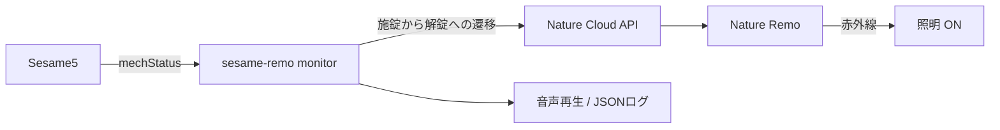

# sesame-remo

Sesame5をBLEで監視し、解錠するとNature Remoで部屋の照明をONにすると同時に、macOSの音声を再生する常駐CLIです。操作元は区別しません。Wi-Fiモジュールは不要です。

照明は、`mechStatus`が施錠中から解錠中へ変化したときにONにします。初回状態がすでに解錠中の場合や、解錠中の状態通知が重複した場合は照明操作を行いません。照明OFFは行いません。



## 必要なもの

- Sesame5とBluetooth通信できるmacOSマシン
- [uv](https://docs.astral.sh/uv/getting-started/installation/)
- Nature Remoアプリで登録済みの照明
- インターネット接続（Nature Cloud API用）

Python 3.13は`.python-version`に従ってuvが管理します。システムPythonを別途用意する必要はありません。

## Sesame側の技術仕様・一次情報

Sesame本体、SesameOS3、BLE通信の仕様を確認するときは、Candy Houseの公式SesameSDKをマスタ参照先とします。

- [SesameSDK Android with DemoApp](https://github.com/CANDY-HOUSE/SesameSDK_Android_with_DemoApp)：Android SDK本体と公式アプリのデモ。`sesame-sdk`配下にSesame5とOS3通信の実装があります。
- [SesameSDK iOS with DemoApp](https://github.com/CANDY-HOUSE/SesameSDK_iOS_with_DemoApp)：iOS SDK本体と公式アプリのデモ。`Sources`配下および`doc`を参照してください。
- [SesameSDK ESP32 with DemoApp](https://github.com/CANDY-HOUSE/SesameSDK_ESP32_with_DemoApp)：組み込み向けの公式参照実装。ESP32-C3からSesame5へBLE接続・登録・制御するサンプルです。

ESP32版は公式の公開リポジトリですが、Sesame5の制御サンプルが中心です。SesameOS3とBLE通信の詳細は、Android SDKとiOS SDKの実装も突き合わせて確認します。

このリポジトリの`sesame_remo/`以下は、上記SDKのうち本アプリに必要なBLE通信とOS3暗号をPythonへ移植したものです。仕様の根拠を確認する場合は、まず公式SDKの実装を確認し、その後に対応する[sesame_client.py](sesame_remo/sesame_client.py)、[ble_protocol.py](sesame_remo/ble_protocol.py)、[crypto.py](sesame_remo/crypto.py)を確認してください。

## セットアップの流れ

初回だけ、次の順番で設定します。

1. リポジトリをcloneして依存関係を入れる
2. Sesame5のUUIDとsecret keyを取得する
3. Nature Remoを設定する
4. foregroundで動作確認する
5. LaunchAgentとして常駐させる

秘密情報はすべて`config.toml`に保存します。このファイルは`.gitignore`に含まれており、Gitには入りません。

## 監視の制約

- BLE接続中は`mechStatus`通知を待ち、通知がしばらく来ないだけでは切断しません。
- BLEクライアントの実際の切断を検出した場合だけ、対象Sesameの次の広告を使って再接続します。
- BLE接続できない間は状態更新も遅れるため、外部機器を安全側へ戻すタイムアウトは利用側で設計してください。
- 音声は短いファイルを`afplay`で繰り返し起動する方式で、完全なシームレスループではありません。
- 施錠、実際のBLE切断、監視終了時には再生中の音声プロセスを停止します。
- Nature Cloud APIの完了を待たずに状態監視を継続します。APIが失敗した場合はJSONログへ記録します。

状態監視の詳細は[状態遷移図](docs/status-monitor-state-machine.md)、公式SDKとの比較は[BLE再接続調査](docs/official-sdk-ble-reconnect.md)、実機で確認した事実は[実機検証記録](docs/field-verification.md)を参照してください。

## 確認用コマンド

現在の状態を1回だけ取得する場合:

```bash
uv run sesame-remo status-dump --config config.toml
```

Sesame共有リンクを解析する場合:

```bash
pbpaste | uv run sesame-remo decode-qr
```

## インストール

```bash
git clone https://github.com/hiroto7/sesame-remo.git
cd sesame-remo
uv sync
cp config.example.toml config.toml
```

macOSでuvが未導入なら、Homebrewでもインストールできます。

```bash
brew install uv
```

## Sesame5を設定する

SesameアプリでSesame5のownerまたはmanager共有リンクを発行し、Macのクリップボードへコピーします。guest鍵はCandy Houseサーバーによる署名が必要なため、このBLE単独版では使えません。

共有リンクには鍵が含まれます。チャットやIssueへ貼らないでください。

```bash
pbpaste | uv run sesame-remo decode-qr
```

表示された2行を`config.toml`の同名項目へコピーします。

```toml
sesame_id = "..."
sesame_secret_key = "..."
```

## Nature Remoを設定する

[Natureのアクセストークン管理画面](https://home.nature.global/)でPersonal Access Tokenを発行し、`config.toml`へ設定します。

```toml
nature_token = "..."
```

tokenをクリップボードへコピーした状態で次を実行すると、登録済みLIGHT家電の名前とappliance IDを確認できます。token自体は表示しません。

```bash
export NATURE_TOKEN="$(pbpaste)"
curl -sS -H "Authorization: Bearer $NATURE_TOKEN" \
  https://api.nature.global/1/appliances \
  | uv run python -c 'import json, sys; [print(a["nickname"], a["id"]) for a in json.load(sys.stdin) if a.get("type") == "LIGHT"]'
unset NATURE_TOKEN
```

対象照明のIDとONボタンを設定します。通常のONは`on`、全灯を使いたい場合は機種に応じて`on-100`などを指定します。

```toml
nature_light_appliance_id = "..."
nature_light_button = "on"
```

## Foreground動作確認

```bash
uv run sesame-remo monitor --config config.toml
```

照明をOFFにしてからSesame5を施錠し、操作元を問わず解錠します。照明がONになり、音声が始まれば成功です。施錠すると音声を停止します。標準出力には接続・切断・状態通知・状態遷移・Nature APIの結果がJSON Linesで出力されます。

音源を変更する場合は`--sound`、音量は`--volume`、繰り返し間隔は`--repeat-gap`で指定します。監視設定は`--scan-timeout`、`--poll-interval`で変更できます。終了は`Ctrl-C`です。

macOSでBluetooth利用許可が表示されたら、実行に使うターミナルを許可してください。

## macOSへ常駐登録する

foregroundで成功した後に行います。リポジトリ直下で次を実行すると、同梱のplistへ現在の絶対パスを埋め込みます。

```bash
PROJECT_DIR="$PWD"
PLIST="$HOME/Library/LaunchAgents/com.example.sesame-remo.plist"
mkdir -p "$HOME/Library/LaunchAgents"
sed \
  -e "s|/absolute/path/to/.venv/bin/python|$PROJECT_DIR/.venv/bin/python|" \
  -e "s|/absolute/path/to/config.toml|$PROJECT_DIR/config.toml|" \
  -e "s|/absolute/path/to/project|$PROJECT_DIR|" \
  launchd/com.example.sesame-remo.plist > "$PLIST"
plutil -lint "$PLIST"
launchctl bootstrap "gui/$(id -u)" "$PLIST"
launchctl kickstart -k "gui/$(id -u)/com.example.sesame-remo"
```

状態確認:

```bash
launchctl print "gui/$(id -u)/com.example.sesame-remo"
```

ログ確認:

```bash
tail -f /tmp/sesame-remo.out.log
tail -f /tmp/sesame-remo.err.log
```

停止・登録解除:

```bash
launchctl bootout "gui/$(id -u)" \
  "$HOME/Library/LaunchAgents/com.example.sesame-remo.plist"
```

plistを変更した場合は、一度`bootout`してから再度`bootstrap`してください。

## 設定項目

| 項目 | 内容 |
|---|---|
| `sesame_id` | Sesame5のUUID |
| `sesame_secret_key` | Sesame5の16-byte secret key |
| `nature_token` | Nature Cloud API Personal Access Token |
| `nature_light_appliance_id` | Nature Remo LIGHT家電ID |
| `nature_light_button` | 送信するLIGHTボタン。通常は`on` |

## トラブルシュート

### `error: ... placeholder ...`

`config.toml`がサンプル値のままです。該当項目を設定してください。

### 状態や照明が更新されない

- MacとSesame5の距離、macOSのBluetooth権限を確認する
- JSONLログの`advertisement_received`、`connection_attempt`、`connected`を確認する
- `status`が受信できていても施錠状態が変わらない場合は、`state_changed`が発生しているか確認する
- `nature_token`と`nature_light_appliance_id`を確認する
- `nature_light_button`をNature Remoのボタン名に合わせる
- foregroundの標準エラー、またはLaunchAgentのエラーログを確認する

### 音声が再生されない

- `--sound`で指定したパスにファイルが存在するか確認する
- macOSの音声出力と音量を確認する

## 開発時の確認

```bash
uv run ruff check .
uv run ruff format --check .
uv run basedpyright --warnings
uv run pytest
```
