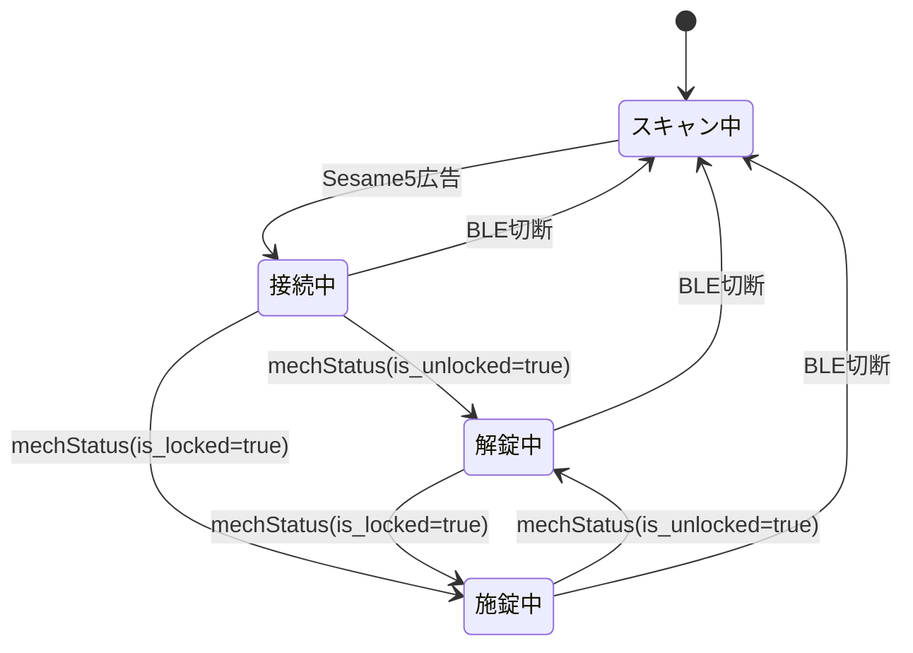

# 状態監視

`sesame-remo monitor`は1つのBLE接続でSesame5の`mechStatus`通知を監視します。履歴の取得・削除や、操作元の判定は行いません。

施錠中から解錠中への遷移でNature Remoへ照明ONを要求し、解錠中では音声を再生します。施錠、BLE切断、監視終了では音声を停止します。Nature APIの失敗はログに記録し、BLE監視は継続します。
