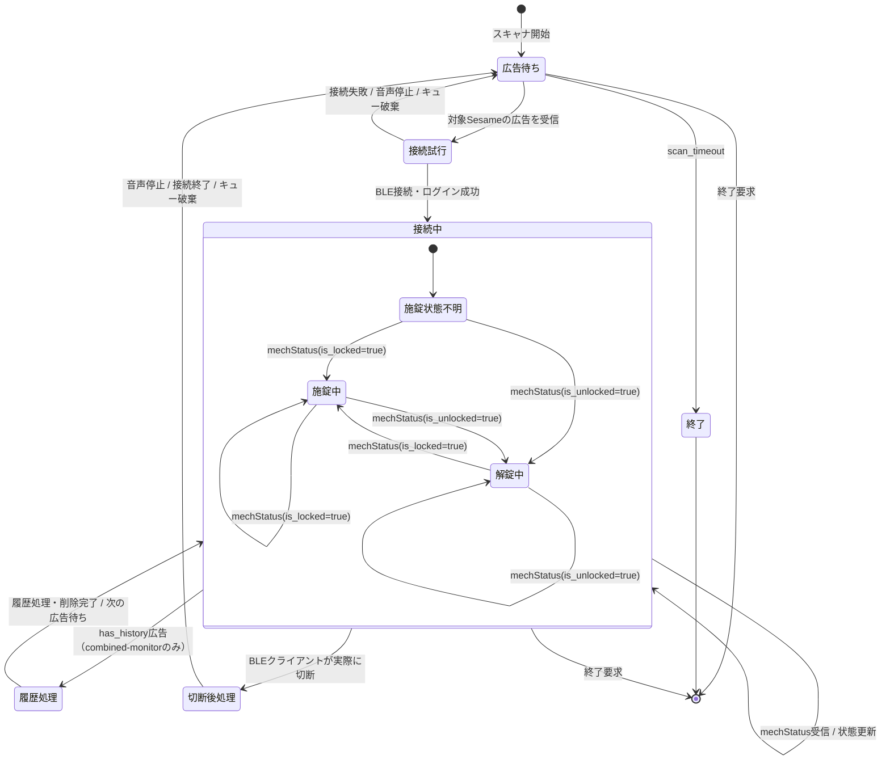

# 状態監視の状態遷移

対象は`lock-state-monitor`および`combined-monitor`のBLE状態監視です。Touch Pro・Sesameアプリ・手動操作を区別せず、Sesame5の現在状態を`mechStatus`で監視します。`combined-monitor`では、同じ「接続中」状態の裏側で履歴監視タスクも動作し、`has_history`広告を受けたときだけ履歴を取得します。

## 状態の意味

| 状態 | 意味 |
|---|---|
| 広告待ち | BLEスキャナを動かし、対象Sesameの広告を待っている。通常の再接続待ちもここに含む。 |
| 接続試行 | 受信した広告を使ってBLE接続・ログインを行っている。 |
| 接続中 | BLE接続を維持し、`mechStatus` publish通知を待っている。 |
| 履歴処理 | `combined-monitor`または`touch-pro-trigger`が、履歴あり広告を起点に認証済み接続で履歴を読み、成功後に削除している。 |
| 切断後処理 | 実際のBLE切断を検出し、音声停止・接続終了・古い広告の破棄を行っている。 |
| 終了 | 広告待ちが`scan_timeout`になった、または監視が終了した状態。 |

## 重要なポイント

- `mechStatus`がしばらく届かないだけでは、接続中から切断後処理へ遷移しません。
- 接続中に受信した広告は再接続用キューへ入れません。
- 実際のBLE切断後、接続終了処理と古い広告の破棄を完了してから、次の広告を再接続に使います。
- 接続失敗時も、現在の接続試行中に溜まった広告を破棄して、次の広告を待ちます。
- `施錠中`・`解錠中`はBLE接続状態の中にある論理状態です。音声再生は`解錠中`への遷移で開始し、`施錠中`への遷移またはBLE切断で停止します。
- `status-dump`の1回取得はこの常駐監視とは別で、`mechStatus`待ちにクライアントのタイムアウトを使います。
- `combined-monitor`では、状態通知と履歴処理を別々のBLE接続で実行しません。履歴処理が一時的に遅くても、状態通知を受ける接続自体は共有されます。

実機で確認した通知頻度、旧実装の15秒再接続ループ、現行実装のログは[実機検証記録](field-verification.md)にあります。
