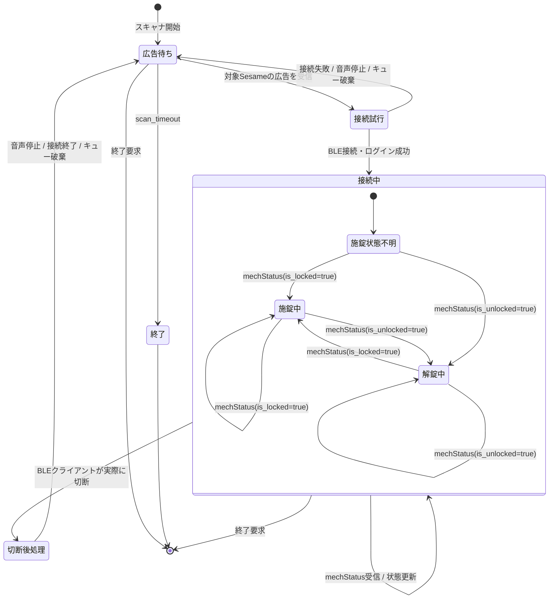

# 状態監視の状態遷移

対象は`sesame-remo monitor`のBLE状態監視です。操作元を区別せず、Sesame5の現在状態を`mechStatus`で監視します。

## 状態の意味

| 状態 | 意味 |
|---|---|
| 広告待ち | BLEスキャナを動かし、対象Sesameの広告を待っている。通常の再接続待ちもここに含む。 |
| 接続試行 | 受信した広告を使ってBLE接続・ログインを行っている。 |
| 接続中 | BLE接続を維持し、`mechStatus` publish通知を待っている。 |
| 切断後処理 | 実際のBLE切断を検出し、音声停止・接続終了・古い広告の破棄を行っている。 |
| 終了 | 広告待ちが`scan_timeout`になった、または監視が終了した状態。 |

## 重要なポイント

- `mechStatus`がしばらく届かないだけでは、接続中から切断後処理へ遷移しません。
- 接続中に受信した広告は再接続用キューへ入れません。
- 実際のBLE切断後、接続終了処理と古い広告の破棄を完了してから、次の広告を再接続に使います。
- 接続失敗時も、現在の接続試行中に溜まった広告を破棄して、次の広告を待ちます。
- `施錠中`・`解錠中`はBLE接続状態の中にある論理状態です。
- `sesame_remo.core`は初回・重複を含む状態通知と、本当に状態が変わった場合の施錠・解錠callbackを分けて利用側へ渡します。
- 同梱の`sesame_remo.automation`では、初回通知が解錠中の場合は音声を開始しますが、状態遷移ではないためNature Remoを操作しません。
- 施錠中から解錠中へ遷移した場合は、音声を開始し、Nature Remoへの照明ON要求と設定済みの解錠用signal要求をバックグラウンドタスクとして開始します。
- 解錠中から施錠中へ遷移した場合は、音声を停止し、設定済みの施錠用signal要求をバックグラウンドタスクとして開始します。
- 同じ状態の重複通知では、Nature Remoの操作を繰り返しません。
- 施錠中への遷移、BLE切断、監視終了時には音声を停止します。
- Nature APIの失敗はJSONログへ記録し、BLE監視は継続します。開始済みのAPIタスクは監視終了時に回収します。
- `status-dump`の1回取得はこの常駐監視とは別で、`mechStatus`待ちにクライアントのタイムアウトを使います。

実機で確認した通知頻度、旧実装の15秒再接続ループ、現行実装のログは[実機検証記録](field-verification.md)にあります。
