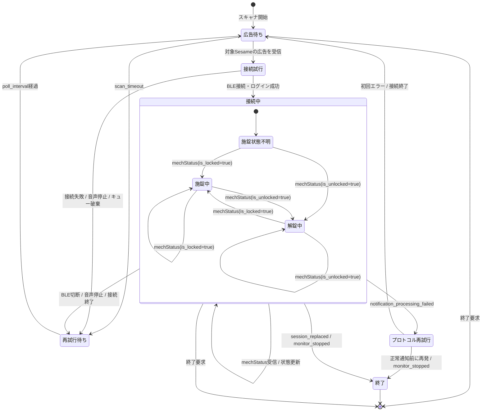

# 状態監視の状態遷移

対象は`sesame-remo monitor`のBLE状態監視です。操作元を区別せず、Sesame5の現在状態を`mechStatus`で監視します。

## 状態の意味

| 状態 | 意味 |
|---|---|
| 広告待ち | BLEスキャナを動かし、対象Sesameの広告を待っている。通常の再接続待ちもここに含む。 |
| 接続試行 | 受信した広告を使ってBLE接続・ログインを行っている。 |
| 接続中 | BLE接続を維持し、`mechStatus` publish通知を待っている。 |
| プロトコル再試行 | 通知の復号・解析に初めて失敗し、BLE接続を閉じて1回だけ再接続しようとしている。 |
| 再試行待ち | 通常の切断・接続失敗・スキャンタイムアウト後に、`poll_interval`の経過を待っている。 |
| 終了 | セッション置換、連続した通知処理失敗、または終了要求により監視を終了した状態。 |

## 重要なポイント

- `mechStatus`がしばらく届かないだけでは、接続中から再試行待ちへ遷移しません。
- ログイン後に新しい`initial`を受信した場合は`session_replaced`として記録し、同じMac上の別クライアントと再認証を奪い合わないよう再接続せず正常終了します。
- 通知の復号・解析失敗は`notification_processing_failed`として記録して1回だけ再接続します。正常な`mechStatus`より先に再発した場合は正常終了し、正常通知を受信できた場合は再試行回数をリセットします。
- プロトコル異常による終了時は`monitor_stopped`を記録します。秘密鍵、トークン、通知ペイロードはエラーログへ出しません。
- 接続中に受信した広告は再接続用キューへ入れません。
- 実際のBLE切断後、接続終了処理と古い広告の破棄を完了してから、次の広告を再接続に使います。
- 接続失敗時も、現在の接続試行中に溜まった広告を破棄して、次の広告を待ちます。
- `施錠中`・`解錠中`はBLE接続状態の中にある論理状態です。
- `sesame_remo.core`は初回・重複を含む状態通知と、本当に状態が変わった場合の施錠・解錠callbackを分けて利用側へ渡します。
- 同梱の`sesame_remo.automation`では、初回通知が解錠中の場合は音声を開始しますが、状態遷移ではないためNature Remoを操作しません。
- 施錠中から解錠中へ遷移した場合は、音声を開始し、Nature Remoへの照明ON要求と設定済みの解錠用signal列をバックグラウンドタスクとして開始します。
- 解錠中から施錠中へ遷移した場合は、音声を停止し、設定済みの施錠用signal列をバックグラウンドタスクとして開始します。
- 1回の状態遷移に設定したsignal列は配列順に送ります。各signalのAPI要求が完了してから次のsignalへ進みますが、BLE監視は待たせません。
- 同じ状態の重複通知では、Nature Remoの操作を繰り返しません。
- 施錠中への遷移、BLE切断、監視終了時には音声を停止します。
- 起動時の名前解決に成功した後のNature API送信失敗はJSONログへ記録し、BLE監視は継続します。開始済みのAPIタスクは監視終了時に回収します。
- `status-dump`の1回取得はこの常駐監視とは別で、`mechStatus`待ちにクライアントのタイムアウトを使います。

実機で確認した通知頻度、旧実装の15秒再接続ループ、公式Sesameアプリとのセッション競合、現行実装のログは[実機検証記録](field-verification.md)にあります。
